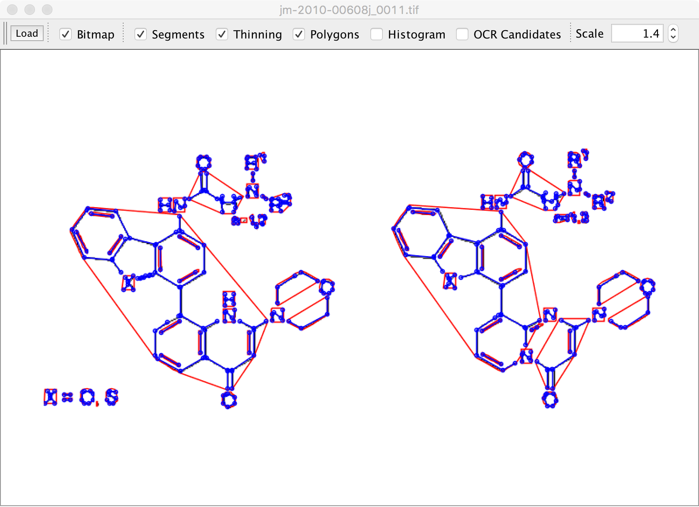

#MolVec
NCATS (chemical) ocr
engine that can a way to vectorize
chemical images into Chemical objects preserving the 2D layout as much as 
possible. The code is still very raw in terms of utility. Please forward
questions and/or problems to tyler.peryea@nih.gov.

#How To Build
   
   This project has a dependency on Chemkit, to install those dependencies automatically using the default CDK implementation, run this command:

   $ bash mavenInstall.sh

   Once the dependencies are installed, you can build the whole project as a jar file with:

   $ mvn clean pacakge

   Or install the project into your maven repository using:

   $ mvn install
   
##Example Usage

    File image = ...
    String mol = Molvec.ocr(image);
    
    
##Async Support

  New in 0.8 MolVec supports asynchronous calls
  
    CompleteableFuture<String> future = Molvec.ocrAsync( image);
    String mol = future.get(5, TimeUnit.SECONDS);
  
##Commandline interface
  The Molvec jar has a runnable Main class with the following options
  
    usage: molvec [ -f <path> | -gui]
     -f,--file <arg>   path of image file to process. Supported formats
                       include png, jpeg, tiff.  This option is required if
                       not using -gui
     -gui              Run Molvec in GUI mode. file and scale option may be
                       set to preload file
     -h,--help         print usage text
     -o,--out <arg>    path of output processed mol. Only valid when not using
                       gui mode. If not specified output is sent to STDOUT
     -scale <arg>      scale of image to show in viewer (only valid if gui
                       mode AND file are specified)
                       
###GUI
  Molvec Comes with a Swing Viewer you can use to step
  through each step of the structure recognition process

